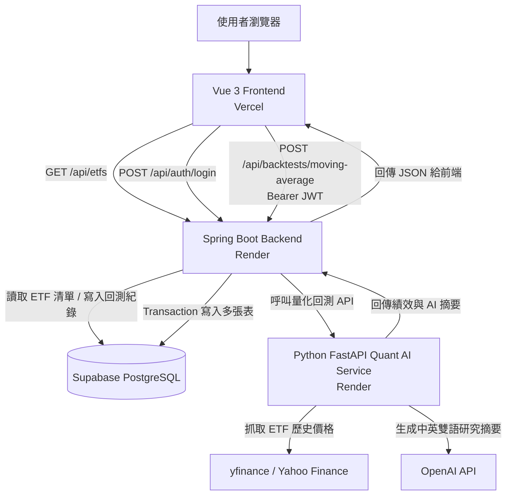
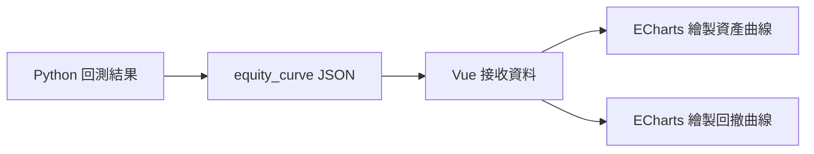
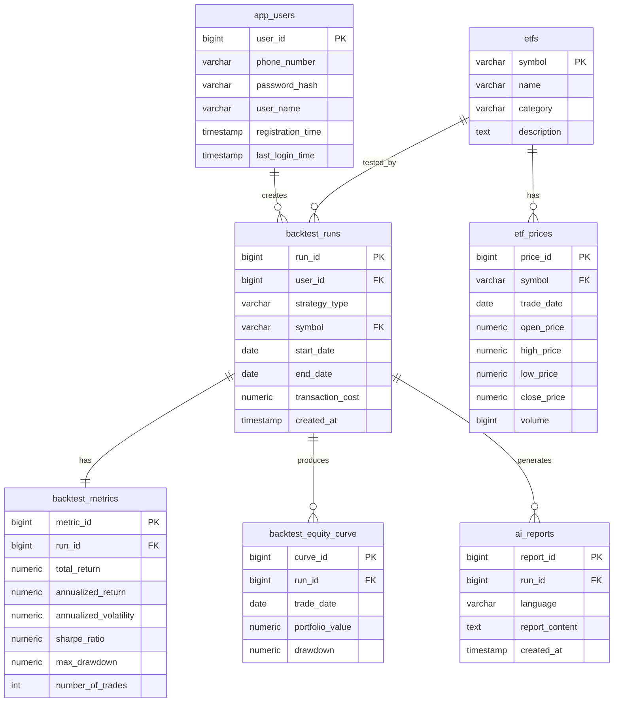
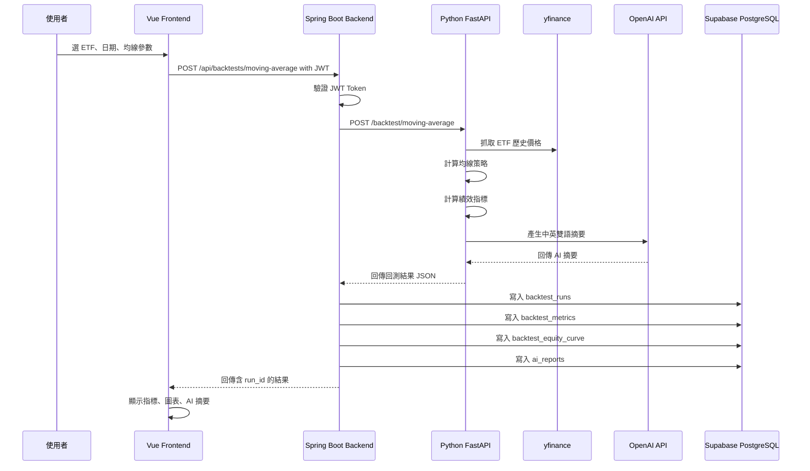
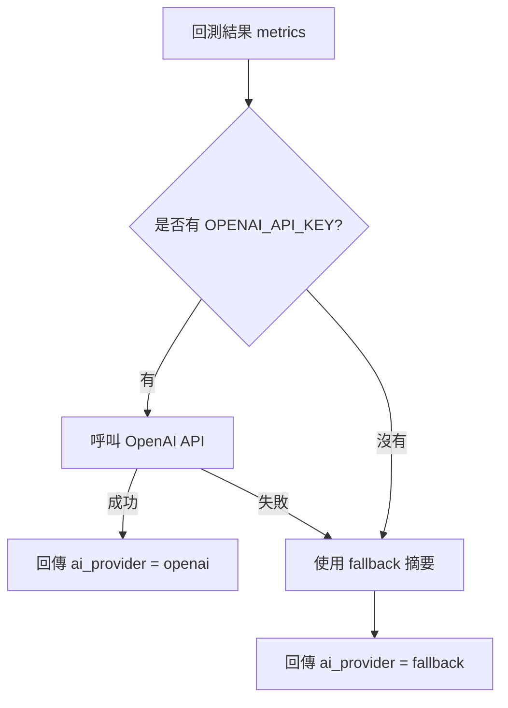
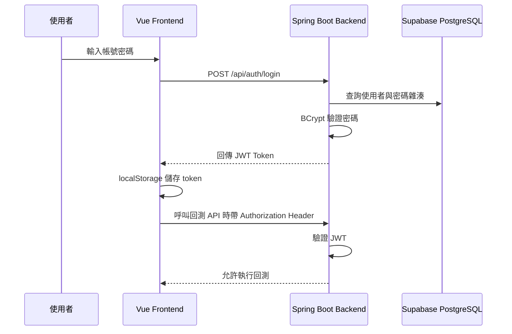
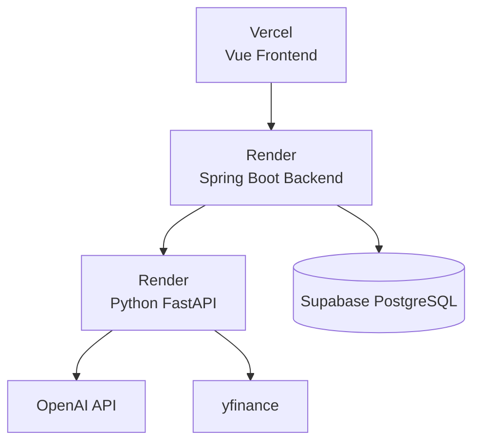

# AI-Powered Taiwan ETF Quant Research Dashboard

> **AI 台股 ETF 量化研究儀表板**  
> 一個結合 **Vue 3 前端、Spring Boot 後端、Supabase PostgreSQL、Python FastAPI、ETF 量化回測、OpenAI 研究摘要、JWT 登入驗證** 的全端金融科技作品。

---

## 目錄

1. [專案簡介](#1-專案簡介)
2. [線上 Demo](#2-線上-demo)
3. [系統架構總覽](#3-系統架構總覽)
4. [核心功能](#4-核心功能)
5. [技術棧總覽](#5-技術棧總覽)
6. [資料庫設計](#6-資料庫設計)
7. [API 與資料流](#7-api-與資料流)
8. [AI 功能設計](#8-ai-功能設計)
9. [登入與安全設計](#9-登入與安全設計)
10. [本機開發啟動方式](#10-本機開發啟動方式)
11. [部署方式](#11-部署方式)
12. [開發與 Debug 紀錄](#12-開發與-debug-紀錄)
13. [專案亮點](#13-專案亮點)
14. [未來擴充方向](#14-未來擴充方向)
15. [免責聲明](#15-免責聲明)

---

## 1. 專案簡介

本專案是一個以台股 ETF 為主題的 **AI-Powered Quant Research Dashboard**。使用者可以透過網頁 Dashboard 選擇 ETF、設定回測日期、均線參數與交易成本，系統會自動完成量化回測、績效計算、AI 研究摘要生成、資料庫儲存與圖表視覺化。

這個作品的設計目標不是單純做一個可以跑回測的小工具，而是展示一個完整的全端金融科技系統如何整合：

- 金融資料分析
- ETF 量化策略回測
- OpenAI 研究摘要生成
- 前後端分離架構
- Spring Boot 企業後端設計
- Supabase PostgreSQL 雲端資料庫
- JWT 登入驗證
- Vercel / Render 雲端部署
- 真實開發過程中的 Debug 與系統調整

使用者操作流程如下：

```text
登入系統
↓
選擇 ETF 與回測參數
↓
執行均線策略回測
↓
Python 服務抓取歷史價格並計算績效
↓
OpenAI 產生中英雙語研究摘要
↓
Spring Boot 將結果寫入 Supabase
↓
Vue 前端呈現績效卡片、資產曲線、最大回撤圖與 AI 摘要
```

---

## 2. 線上 Demo

| 服務 | 網址 | 說明 |
|---|---|---|
| 前端 Vue Dashboard | https://ai-powered-taiwan-etf-quant-dashboa.vercel.app/ | 使用者操作介面 |
| Spring Boot Backend | https://taiwan-etf-springboot-backend.onrender.com | 主要後端 REST API |
| Python Quant AI Service | https://taiwan-etf-quant-ai-service.onrender.com | ETF 回測與 AI 摘要服務 |

### Render 免費服務提醒

本專案的 Spring Boot 後端與 Python FastAPI 服務部署於 Render Free Plan。Render 免費服務閒置後可能進入休眠狀態，因此第一次開啟或第一次執行回測時，可能需要等待 30～60 秒以上。

展示前建議先手動喚醒：

```text
https://taiwan-etf-springboot-backend.onrender.com/api/health
https://taiwan-etf-quant-ai-service.onrender.com/
```

---

## 3. 系統架構總覽

本專案採用三服務架構：

```text
Frontend：Vue 3 + Vite + ECharts
Backend：Spring Boot + Spring Security + Supabase PostgreSQL
AI Service：Python FastAPI + yfinance + pandas + OpenAI API
```



### 架構設計說明

| 層級 | 服務 | 負責內容 |
|---|---|---|
| 前端展示層 | Vue 3 | 表單、登入、圖表、AI 摘要展示 |
| 後端業務層 | Spring Boot | REST API、JWT、資料庫、Transaction、CORS |
| 量化 AI 層 | Python FastAPI | 抓股價、回測、績效計算、OpenAI 摘要 |
| 資料持久層 | Supabase PostgreSQL | 使用者、ETF、回測紀錄、AI 報告 |

這樣拆分的好處是每一層責任明確：前端負責互動，後端負責安全與資料一致性，Python 負責量化與 AI，PostgreSQL 負責資料保存。

---

## 4. 核心功能

### 4.1 ETF 清單讀取

ETF 清單不是寫死在前端，而是存在 Supabase PostgreSQL 的 `etfs` 資料表中。

前端透過：

```http
GET /api/etfs
```

取得 ETF 清單，例如：

| Symbol | ETF 名稱 | 類型 |
|---|---|---|
| 0050.TW | 元大台灣50 | Market Cap Weighted ETF |
| 0056.TW | 元大高股息 | High Dividend ETF |
| 006208.TW | 富邦台50 | Market Cap Weighted ETF |
| 00713.TW | 元大台灣高息低波 | Low Volatility High Dividend ETF |
| 00878.TW | 國泰永續高股息 | ESG High Dividend ETF |

---

### 4.2 均線策略回測

目前第一版實作的是 **Moving Average Strategy（均線策略）**。

策略邏輯如下：

```text
若短期均線 > 長期均線：持有 ETF
若短期均線 <= 長期均線：空手
```

預設參數：

```text
Short MA：20
Long MA：60
Transaction Cost：0.001425
```

為了避免偷看未來資料，策略使用前一日訊號：

```text
今天是否持有 ETF = 昨天產生的均線訊號
```

這可以避免常見的量化研究錯誤：**look-ahead bias（前視偏誤）**。

---

### 4.3 交易成本模擬

每次部位改變時，系統會扣除交易成本。

```text
strategy_return = position * daily_return - transaction_cost
```

這讓回測結果更接近真實交易，而不是完全理想化的策略績效。

---

### 4.4 績效指標計算

Python 服務會計算以下指標：

| 指標 | 說明 |
|---|---|
| Total Return | 整段期間總報酬 |
| Annualized Return | 年化報酬率 |
| Annualized Volatility | 年化波動率 |
| Sharpe Ratio | 風險調整後報酬 |
| Max Drawdown | 最大回撤 |
| Number of Trades | 交易次數 |

這些指標可協助使用者同時觀察策略的報酬、波動、風險、回撤與交易頻率。

---

### 4.5 圖表視覺化

前端使用 ECharts 顯示兩張重要圖表：

1. **Equity Curve（資產曲線）**
2. **Drawdown Curve（最大回撤曲線）**



---

### 4.6 AI 中英雙語研究摘要

系統會根據回測結果產生：

- 中文研究摘要
- English Summary
- 風險說明
- 教育與研究用途聲明

API 回傳中會包含：

```json
{
  "ai_provider": "openai",
  "ai_summary_zh": "...",
  "ai_summary_en": "..."
}
```

如果 OpenAI API key 沒有設定，或 OpenAI 呼叫失敗，系統會自動使用 fallback 摘要：

```json
{
  "ai_provider": "fallback"
}
```

這個設計可以讓系統在 AI 服務暫時失效時仍然能正常運作。

---

### 4.7 登入與權限保護

因為 OpenAI API 會產生成本，本專案加入 JWT 登入機制。

公開 API：

```text
GET  /api/health
GET  /api/etfs
POST /api/auth/register
POST /api/auth/login
```

受保護 API：

```text
POST /api/backtests/moving-average
```

前端登入後會將 JWT token 存在 `localStorage`，並透過 Axios interceptor 自動加入：

```http
Authorization: Bearer <JWT_TOKEN>
```

---

## 5. 技術棧總覽

### 5.1 Frontend

| 技術 | 用途 |
|---|---|
| Vue 3 | 前端框架 |
| Vite | 開發與建置工具 |
| Axios | 串接後端 API |
| ECharts | 資產曲線與回撤圖 |
| localStorage | 儲存 JWT 與登入者資訊 |
| Vercel | 前端部署 |

### 5.2 Backend

| 技術 | 用途 |
|---|---|
| Spring Boot | 主要後端 REST API |
| Spring Security | API 權限控管 |
| JWT | 無狀態登入驗證 |
| BCrypt | 密碼雜湊 |
| JdbcTemplate | 執行 SQL 與 PostgreSQL Function |
| Transaction | 多資料表寫入一致性 |
| HikariCP | PostgreSQL 連線池管理 |
| Docker | Render 部署 |
| Render | 後端雲端部署 |

### 5.3 Quant AI Service

| 技術 | 用途 |
|---|---|
| Python | 量化分析主語言 |
| FastAPI | Python API 框架 |
| pandas | 資料整理與時間序列處理 |
| NumPy | 數值運算 |
| yfinance | 抓取 ETF 歷史價格 |
| OpenAI API | 生成中英雙語研究摘要 |
| Uvicorn | FastAPI ASGI server |
| Render | AI 服務雲端部署 |

### 5.4 Database

| 技術 | 用途 |
|---|---|
| Supabase PostgreSQL | 雲端資料庫 |
| SQL DDL | 建立資料表 |
| Seed Data | 初始化 ETF 清單 |
| PostgreSQL Function | 類 Stored Procedure 查詢 |
| Supabase Pooler | 雲端連線池 |

---

## 6. 資料庫設計



### 資料表說明

| Table | 說明 |
|---|---|
| `app_users` | 系統使用者帳號資料 |
| `etfs` | ETF 基本資料 |
| `etf_prices` | ETF 價格快取，預留擴充使用 |
| `backtest_runs` | 每一次回測任務紀錄 |
| `backtest_metrics` | 每次回測的績效指標 |
| `backtest_equity_curve` | 每次回測的資產曲線與回撤資料 |
| `ai_reports` | AI 產生的中英摘要 |

---

## 7. API 與資料流

### 7.1 Spring Boot API

| Method | Endpoint | 權限 | 說明 |
|---|---|---|---|
| GET | `/api/health` | Public | 後端健康檢查 |
| GET | `/api/etfs` | Public | 取得 ETF 清單 |
| POST | `/api/auth/register` | Public | 使用註冊碼建立帳號 |
| POST | `/api/auth/login` | Public | 登入並取得 JWT |
| POST | `/api/backtests/moving-average` | JWT Required | 執行均線策略回測 |

### 7.2 Python FastAPI API

| Method | Endpoint | 說明 |
|---|---|---|
| GET | `/` | AI 服務健康檢查 |
| POST | `/backtest/moving-average` | 執行 ETF 均線策略回測 |

### 7.3 回測流程圖



---

## 8. AI 功能設計

### 8.1 為什麼需要 AI？

單純的量化回測只能提供數字，例如：

```text
Annualized Return = 18.71%
Sharpe Ratio = 1.16
Max Drawdown = -29.43%
```

但對初學者來說，這些數字不一定容易理解。因此本專案使用 OpenAI API 扮演 **AI Quant Research Analyst**，將績效指標轉換成中英雙語研究摘要，協助使用者理解策略表現與風險。

### 8.2 OpenAI 與 fallback 機制



這樣設計可以避免 OpenAI API 暫時失效時整個系統壞掉，也方便本機開發與部署環境切換。

---

## 9. 登入與安全設計

### 9.1 為什麼要登入？

因為回測功能可能呼叫 OpenAI API，而 OpenAI API 會產生成本，因此本專案將回測 API 設為登入後才能使用。

### 9.2 JWT 驗證流程



### 9.3 Registration Code

為了避免任何人自由註冊消耗 API 額度，註冊時需要輸入註冊碼：

```text
REGISTER_CODE=private-register-code
```

此註冊碼只存在於後端環境變數，不會放在前端，也不會提交到 GitHub。

---

## 10. 本機開發啟動方式

本專案本機開發需要同時啟動三個服務：

```text
Terminal 1：Python FastAPI
Terminal 2：Spring Boot Backend
Terminal 3：Vue Frontend
```

### 10.1 啟動 Python Quant AI Service

```powershell
cd quant-ai-service
python -m venv venv
.\venv\Scripts\activate
pip install -r requirements.txt
```

若要使用 OpenAI API：

```powershell
$env:OPENAI_API_KEY="your-openai-api-key"
$env:OPENAI_MODEL="gpt-4.1-mini"
```

啟動服務：

```powershell
uvicorn app.main:app --reload --port 8000
```

測試：

```text
http://localhost:8000
http://localhost:8000/docs
```

### 10.2 啟動 Spring Boot Backend

```powershell
cd backend-springboot
```

設定環境變數：

```powershell
$env:DB_URL="jdbc:postgresql://your-supabase-pooler-host:5432/postgres?sslmode=require"
$env:DB_USERNAME="postgres.your-project-ref"
$env:DB_PASSWORD="your-supabase-database-password"
$env:QUANT_API_BASE_URL="http://localhost:8000"
$env:JWT_SECRET="your-long-jwt-secret"
$env:REGISTER_CODE="your-private-register-code"
```

啟動：

```powershell
.\mvnw.cmd spring-boot:run
```

測試：

```text
http://localhost:8080/api/health
http://localhost:8080/api/etfs
```

### 10.3 啟動 Vue Frontend

```powershell
cd frontend-vue
npm install
npm run dev
```

測試：

```text
http://localhost:5173
```

---

## 11. 部署方式

### 11.1 部署架構



### 11.2 Frontend：Vercel

Vercel 設定：

```text
Root Directory: frontend-vue
Build Command: npm run build
Output Directory: dist
```

Vercel 環境變數：

```text
VITE_API_BASE_URL=https://taiwan-etf-springboot-backend.onrender.com/api
```

### 11.3 Backend：Render

Render Spring Boot Backend 使用 Docker 部署。

Render 環境變數：

```text
DB_URL=jdbc:postgresql://your-supabase-pooler-host:5432/postgres?sslmode=require
DB_USERNAME=postgres.your-project-ref
DB_PASSWORD=your-supabase-database-password
QUANT_API_BASE_URL=https://taiwan-etf-quant-ai-service.onrender.com
FRONTEND_ALLOWED_ORIGINS=https://your-vercel-domain.vercel.app,http://localhost:5173
JWT_SECRET=your-long-jwt-secret
REGISTER_CODE=your-private-register-code
```

重要設定：

```properties
server.port=${PORT:8080}
```

Render 會提供自己的 `$PORT`，Spring Boot 必須讀取這個 port 才能正確啟動。

### 11.4 Python AI Service：Render

Render Python FastAPI 設定：

```text
Root Directory: quant-ai-service
Build Command: pip install -r requirements.txt
Start Command: uvicorn app.main:app --host 0.0.0.0 --port $PORT
```

環境變數：

```text
OPENAI_API_KEY=your-openai-api-key
OPENAI_MODEL=gpt-4.1-mini
```

如果沒有設定 OpenAI API key，系統仍可使用 fallback 摘要。

### 11.5 Supabase PostgreSQL

Supabase 中執行：

```text
DB/01_schema.sql
DB/02_seed_data.sql
DB/03_stored_procedures.sql
```

資料庫連線建議使用 Supabase Pooler URL，並搭配 HikariCP 限制連線數，避免 Render 部署時連線池過大。

---

## 12. 開發與 Debug 紀錄

本專案開發過程中遇到多個真實工程問題，以下整理為 Debug 紀錄。

### 12.1 Spring Boot DataSource 啟動失敗

問題：

```text
Failed to configure a DataSource
url attribute is not specified
```

原因：

Spring Boot 專案加入了 PostgreSQL Driver 與 JPA，但一開始尚未設定資料庫連線。

解法：

開發初期先暫時停用自動資料庫設定，後續接上 Supabase 後改用環境變數。

---

### 12.2 SecurityConfig duplicate class

問題：

```text
duplicate class: com.jimmy.etfquant.config.SecurityConfig
```

原因：

`SecurityConfig.java` 不小心放到 `controller` 資料夾，同時又有一份在 `config` 資料夾。

解法：

刪除錯誤位置的檔案，只保留：

```text
src/main/java/com/jimmy/etfquant/config/SecurityConfig.java
```

---

### 12.3 Supabase 帳號設定錯誤

問題：

```text
FATAL: password authentication failed for user "postgres"
```

原因：

使用 Supabase pooler 時，username 不是單純的 `postgres`，而是類似：

```text
postgres.project-ref
```

解法：

Render 與本機環境變數需使用正確 pooler username。

---

### 12.4 Supabase pooler 連線數爆滿

問題：

```text
EMAXCONNSESSION max clients reached in session mode
```

原因：

Spring Boot 預設 HikariCP 可能建立過多連線，而 Supabase pooler session mode 有連線數限制。

解法：

限制 HikariCP 連線數：

```properties
spring.datasource.hikari.maximum-pool-size=2
spring.datasource.hikari.minimum-idle=0
spring.datasource.hikari.idle-timeout=30000
spring.datasource.hikari.max-lifetime=300000
spring.datasource.hikari.connection-timeout=30000
```

---

### 12.5 Vercel 前端抓不到 API

問題：

```text
Failed to load ETF list from backend.
```

原因：

前端部署後仍可能指向 `localhost:8080`，或後端 CORS 尚未允許 Vercel 網址。

解法：

前端使用 Vite 環境變數：

```text
VITE_API_BASE_URL=https://taiwan-etf-springboot-backend.onrender.com/api
```

Spring Boot CORS 加入：

```text
FRONTEND_ALLOWED_ORIGINS=https://your-vercel-domain.vercel.app,http://localhost:5173
```

---

### 12.6 Render cold start

問題：

```text
Backtest failed. Please check backend and quant service.
```

原因：

Render Free Plan 服務閒置後會休眠。當 Spring Boot 呼叫 Python FastAPI 時，Python service 可能尚未喚醒。

解法：

展示前先開啟：

```text
https://taiwan-etf-springboot-backend.onrender.com/api/health
https://taiwan-etf-quant-ai-service.onrender.com/
```

---

### 12.7 OpenAI 是否真的有跑

問題：

AI 摘要看起來可能像 fallback，無法確認是否真的呼叫 OpenAI。

解法：

在 API 回傳加入：

```json
{
  "ai_provider": "openai"
}
```

或：

```json
{
  "ai_provider": "fallback"
}
```

這讓前端與開發者可以直接確認目前使用的是 OpenAI 還是規則式摘要。

---

## 13. 專案亮點

### 13.1 完整全端能力

本專案完整涵蓋：

- Vue 前端
- Spring Boot 後端
- Python AI 服務
- PostgreSQL 資料庫
- Vercel / Render / Supabase 部署

這不是單純前端作品，也不是單純 Notebook，而是一個完整的全端系統。

### 13.2 金融科技應用

主題聚焦台股 ETF，包含：

- ETF 歷史價格
- 均線策略
- 交易成本
- 風險與報酬
- 最大回撤
- AI 研究摘要

### 13.3 AI 整合不是裝飾

AI 不是單純聊天機器人，而是嵌入量化研究流程：

```text
回測結果 → 數據摘要 → LLM 解釋 → 中英雙語研究摘要
```

### 13.4 Transaction 與資料一致性

每次回測會寫入多張資料表。使用 Spring `@Transactional` 確保資料一致性。

### 13.5 安全性設計

本專案加入：

- BCrypt 密碼雜湊
- JWT Token
- Registration Code
- CORS 設定
- 環境變數保護密碼與 API Key
- OpenAI 額度保護

---

## 14. 未來擴充方向

### 14.1 更多策略

目前已完成均線策略，未來可加入：

- Momentum Strategy
- RSI Strategy
- MACD Strategy
- Volatility Targeting
- Factor-based Strategy
- Buy and Hold Benchmark

### 14.2 更完整的 AI 報告

未來可讓 OpenAI 生成完整研究報告：

- Abstract
- Research Motivation
- Data Source
- Methodology
- Backtesting Results
- Risk Analysis
- Limitations
- Conclusion

### 14.3 使用者歷史紀錄頁面

目前回測結果已存進資料庫，未來可在前端加入：

- 我的回測紀錄
- 回測結果比較
- 下載報告
- 儲存常用策略參數

### 14.4 更正式的資料來源

目前 MVP 使用 yfinance 抓取 ETF 歷史價格。未來可擴充：

- TWSE 官方資料
- ETF 配息資料
- 成分股資料
- 基準指數資料

### 14.5 部署升級

未來可考慮：

- Render paid instance 避免 cold start
- Docker Compose 本機完整啟動
- CI/CD 自動測試
- 雲端監控與 log 管理

---

## 15. 免責聲明

本系統僅供教育、研究與作品集展示用途，不構成任何投資建議。所有回測結果皆基於歷史資料與簡化假設，過去績效不代表未來表現。

This system is for educational, research, and portfolio demonstration purposes only. It does not constitute investment advice. Backtesting results are based on historical data and simplified assumptions. Past performance does not guarantee future results.

---

## 16. Author

Developed by **Jimmy Chang / 張祐豪**

This project demonstrates full-stack software engineering, financial data analysis, AI integration, cloud deployment, authentication design, and practical debugging ability through a fintech research dashboard.

