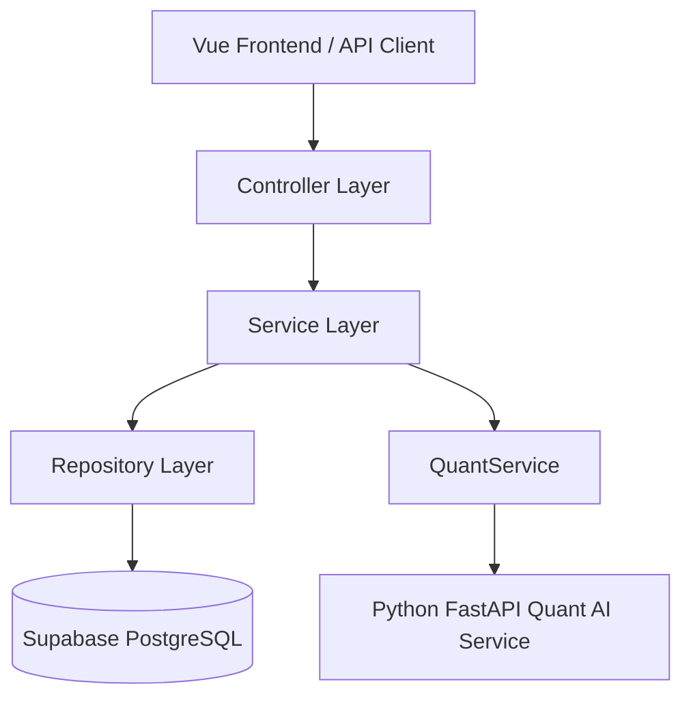
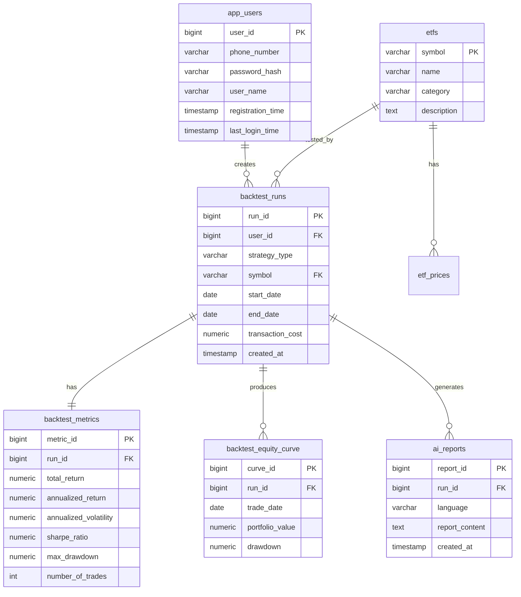
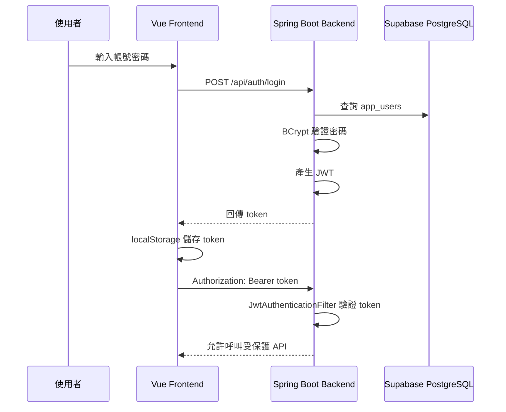
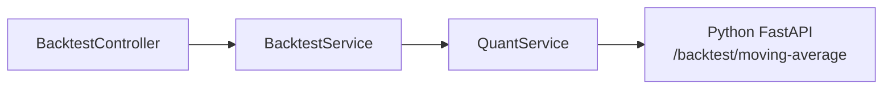
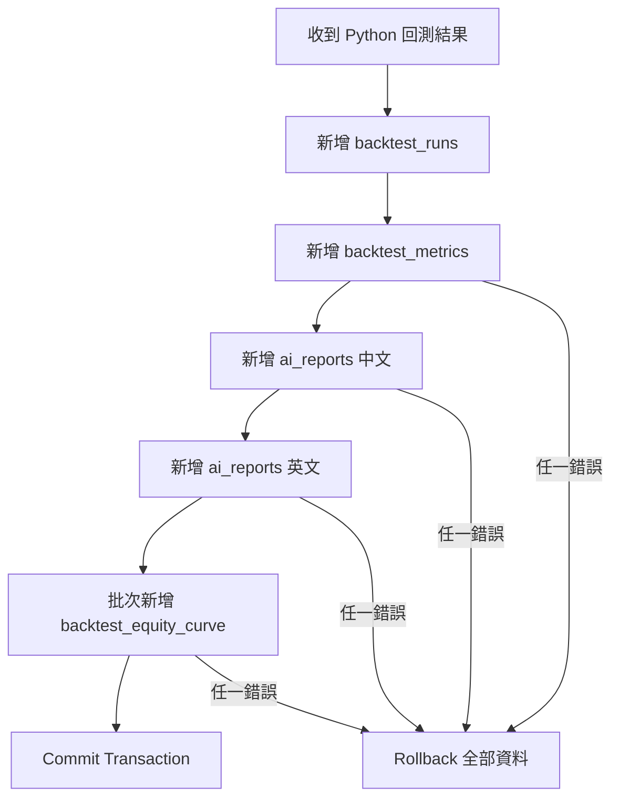

# backend-springboot README

> **Spring Boot 後端服務**  
> 本服務是 AI-Powered Taiwan ETF Quant Research Dashboard 的主要後端 API，負責 RESTful API、Supabase PostgreSQL 資料存取、JWT 登入驗證、BCrypt 密碼雜湊、Transaction 多表寫入、CORS 設定，以及串接 Python Quant AI Service。

---

## 目錄

1. [服務定位](#1-服務定位)
2. [線上服務網址](#2-線上服務網址)
3. [後端架構總覽](#3-後端架構總覽)
4. [資料夾結構](#4-資料夾結構)
5. [使用技術](#5-使用技術)
6. [主要 API](#6-主要-api)
7. [資料庫與 Supabase 設計](#7-資料庫與-supabase-設計)
8. [Stored Procedure / PostgreSQL Function 設計](#8-stored-procedure--postgresql-function-設計)
9. [JWT 登入與權限保護](#9-jwt-登入與權限保護)
10. [Spring Boot 呼叫 Python Quant AI Service](#10-spring-boot-呼叫-python-quant-ai-service)
11. [Transaction 多資料表寫入設計](#11-transaction-多資料表寫入設計)
12. [CORS 設定](#12-cors-設定)
13. [HikariCP 與 Supabase Pooler](#13-hikaricp-與-supabase-pooler)
14. [本機啟動方式](#14-本機啟動方式)
15. [Render 部署方式](#15-render-部署方式)
16. [測試方式](#16-測試方式)
17. [Debug 紀錄](#17-debug-紀錄)
18. [目前限制](#18-目前限制)
19. [未來擴充方向](#19-未來擴充方向)

---

## 1. 服務定位

`backend-springboot` 是本專案的 **主要後端服務**，負責將前端、資料庫與 Python 量化 AI 服務串起來。

它在整個系統中的角色如下：

```text
Vue Frontend
    ↓
Spring Boot Backend
    ↓                  ↓
Supabase PostgreSQL    Python FastAPI Quant AI Service
```

Spring Boot 後端主要負責：

1. 提供 RESTful API 給前端呼叫
2. 從 Supabase PostgreSQL 讀取 ETF 清單
3. 提供使用者註冊與登入 API
4. 使用 BCrypt 儲存密碼雜湊
5. 使用 JWT 保護回測 API
6. 呼叫 Python FastAPI 執行 ETF 回測
7. 將回測結果以 Transaction 寫入多張資料表
8. 處理 CORS，允許 Vercel 前端呼叫後端
9. 使用環境變數管理資料庫密碼、JWT secret、AI 服務 URL
10. 部署至 Render 雲端平台

本服務的設計重點不是只做一支 API，而是展示較完整的企業後端觀念：

- 分層架構
- 權限控管
- 安全密碼處理
- Transaction 一致性
- 外部服務整合
- 雲端部署
- 連線池調校
- Debug 與錯誤排查

---

## 2. 線上服務網址

Render 部署網址：

```text
https://taiwan-etf-springboot-backend.onrender.com
```

健康檢查：

```text
GET https://taiwan-etf-springboot-backend.onrender.com/api/health
```

ETF 清單：

```text
GET https://taiwan-etf-springboot-backend.onrender.com/api/etfs
```

> 注意：本服務部署於 Render Free Plan。若長時間沒有流量，服務可能會休眠。第一次請求可能需要等待 30～60 秒以上。

---

## 3. 後端架構總覽

本後端採用典型 Spring Boot 分層設計：



### 分層說明

| Layer | 對應資料夾 | 負責內容 |
|---|---|---|
| Controller | `controller/` | 接收 HTTP request，回傳 response |
| Service | `service/` | 商業邏輯、驗證流程、交易流程 |
| Repository | `repository/` | 使用 JdbcTemplate 存取資料庫 |
| DTO | `dto/` | 定義 request / response 資料格式 |
| Config | `config/` | Spring Security、JWT Filter、CORS 設定 |

---

## 4. 資料夾結構

```text
backend-springboot/
│
├── src/main/java/com/jimmy/etfquant/
│   │
│   ├── EtfquantApplication.java
│   │
│   ├── config/
│   │   ├── SecurityConfig.java
│   │   └── JwtAuthenticationFilter.java
│   │
│   ├── controller/
│   │   ├── HealthController.java
│   │   ├── EtfController.java
│   │   ├── BacktestController.java
│   │   └── AuthController.java
│   │
│   ├── dto/
│   │   ├── EtfResponse.java
│   │   ├── MovingAverageBacktestRequest.java
│   │   ├── MovingAverageBacktestResponse.java
│   │   ├── EquityCurvePoint.java
│   │   ├── RegisterRequest.java
│   │   ├── LoginRequest.java
│   │   ├── AuthResponse.java
│   │   └── AppUser.java
│   │
│   ├── repository/
│   │   ├── EtfRepository.java
│   │   ├── AuthRepository.java
│   │   └── BacktestPersistenceRepository.java
│   │
│   └── service/
│       ├── EtfService.java
│       ├── QuantService.java
│       ├── BacktestService.java
│       ├── BacktestPersistenceService.java
│       ├── AuthService.java
│       └── JwtService.java
│
├── src/main/resources/
│   └── application.properties
│
├── Dockerfile
├── pom.xml
├── mvnw
├── mvnw.cmd
├── .env.example
├── .gitignore
└── README.md
```

---

## 5. 使用技術

| 技術 | 用途 |
|---|---|
| Java 17 | 後端主要語言 |
| Spring Boot | 建立 RESTful API |
| Spring Web | Controller / HTTP API |
| Spring Security | 登入驗證與 API 權限保護 |
| BCrypt | 密碼雜湊 |
| JWT | 無狀態使用者驗證 |
| JdbcTemplate | 執行 SQL 與 PostgreSQL Function |
| Transaction Management | 多資料表寫入一致性 |
| PostgreSQL Driver | 連接 Supabase PostgreSQL |
| HikariCP | 資料庫連線池 |
| Docker | 雲端部署打包 |
| Render | Spring Boot 後端部署 |
| Supabase PostgreSQL | 雲端資料庫 |

---

## 6. 主要 API

### 6.1 API 總覽

| Method | Endpoint | 權限 | 說明 |
|---|---|---|---|
| GET | `/api/health` | Public | 健康檢查 |
| GET | `/api/etfs` | Public | 取得 ETF 清單 |
| POST | `/api/auth/register` | Public | 使用註冊碼建立帳號 |
| POST | `/api/auth/login` | Public | 登入並取得 JWT |
| POST | `/api/backtests/moving-average` | JWT Required | 執行均線策略回測並存入資料庫 |

---

### 6.2 Health Check

```http
GET /api/health
```

用途：

- 確認 Spring Boot 後端是否啟動
- Render cold start 後用來喚醒後端
- 前端與開發者可快速檢查服務狀態

Response example：

```json
{
  "status": "ok",
  "message": "AI Taiwan ETF Quant Backend is running"
}
```

---

### 6.3 ETF List

```http
GET /api/etfs
```

用途：

- 從 Supabase PostgreSQL 取得 ETF 清單
- 前端下拉選單使用

Response example：

```json
[
  {
    "symbol": "0050.TW",
    "name": "元大台灣50",
    "category": "Market Cap Weighted ETF",
    "description": "Tracks the performance of the Taiwan 50 Index."
  }
]
```

實作重點：

- 不是直接查表，而是透過 PostgreSQL function `sp_get_all_etfs()`
- 使用 `JdbcTemplate` 呼叫 SQL
- 用 `EtfResponse` record 作為 response DTO

---

### 6.4 Register

```http
POST /api/auth/register
```

Request：

```json
{
  "phone_number": "0912345678",
  "password": "test123456",
  "user_name": "Jimmy",
  "registration_code": "your-register-code"
}
```

Response：

```json
{
  "user_id": 1,
  "phone_number": "0912345678",
  "user_name": "Jimmy",
  "token": "jwt-token"
}
```

設計重點：

- 註冊必須輸入 registration code
- 密碼不會明文存入資料庫
- 密碼會經過 BCrypt 雜湊後存入 `app_users.password_hash`
- 註冊成功後直接回傳 JWT token

---

### 6.5 Login

```http
POST /api/auth/login
```

Request：

```json
{
  "phone_number": "0912345678",
  "password": "test123456"
}
```

Response：

```json
{
  "user_id": 1,
  "phone_number": "0912345678",
  "user_name": "Jimmy",
  "token": "jwt-token"
}
```

登入成功後，前端會將 token 存到 `localStorage`，並在呼叫受保護 API 時加入：

```http
Authorization: Bearer <JWT_TOKEN>
```

---

### 6.6 Moving Average Backtest

```http
POST /api/backtests/moving-average
Authorization: Bearer <JWT_TOKEN>
```

Request：

```json
{
  "symbol": "0050.TW",
  "start_date": "2020-01-01",
  "end_date": "2025-12-31",
  "short_window": 20,
  "long_window": 60,
  "transaction_cost": 0.001425
}
```

Response example：

```json
{
  "run_id": 1,
  "symbol": "0050.TW",
  "strategy": "moving_average",
  "total_return": 1.695733,
  "annualized_return": 0.187105,
  "annualized_volatility": 0.160114,
  "sharpe_ratio": 1.168571,
  "max_drawdown": -0.294348,
  "number_of_trades": 19,
  "ai_provider": "openai",
  "ai_summary_zh": "...",
  "ai_summary_en": "...",
  "equity_curve": []
}
```

此 API 會：

1. 驗證 JWT
2. 呼叫 Python FastAPI 執行回測
3. 取得績效指標與 AI 摘要
4. 使用 Transaction 寫入 Supabase
5. 回傳含 `run_id` 的結果給前端

---

## 7. 資料庫與 Supabase 設計

### 7.1 資料表總覽

| Table | 說明 |
|---|---|
| `app_users` | 使用者帳號與密碼雜湊 |
| `etfs` | ETF 基本資料 |
| `etf_prices` | ETF 價格快取預留表 |
| `backtest_runs` | 每一次回測任務 |
| `backtest_metrics` | 回測績效指標 |
| `backtest_equity_curve` | 回測資產曲線與回撤 |
| `ai_reports` | AI 中英摘要 |

---

### 7.2 ER Diagram



---

### 7.3 為什麼使用 Supabase PostgreSQL？

Supabase 提供雲端 PostgreSQL，適合此專案原因：

- 可快速建立雲端資料庫
- 支援標準 PostgreSQL SQL
- 可直接使用 SQL Editor 執行 DDL / Seed / Function
- 適合部署版後端連線
- 可在 Table Editor 檢查資料寫入結果

本專案沒有使用 Supabase Auth，而是自己透過 Spring Boot 實作 `app_users`、BCrypt 與 JWT。這樣可以完整展示後端身份驗證設計。

---

## 8. Stored Procedure / PostgreSQL Function 設計

本專案在 `DB/03_stored_procedures.sql` 中建立 PostgreSQL function，作為類似 stored procedure 的資料存取方式。

### 8.1 `sp_get_all_etfs()`

用途：取得所有 ETF 清單。

```sql
SELECT symbol, name, category, description
FROM sp_get_all_etfs();
```

後端呼叫方式：

```java
String sql = "SELECT symbol, name, category, description FROM sp_get_all_etfs()";
```

這樣做的好處：

- 資料查詢邏輯集中在資料庫 function
- 後端 repository 不需要直接知道複雜查詢
- 未來如果 ETF 清單查詢邏輯變複雜，可以改 function 而不一定要改後端 API

---

### 8.2 `sp_get_etf_price_history(p_symbol)`

用途：預留未來從資料庫取得 ETF 歷史價格。

目前價格主要由 Python yfinance 即時下載，但已預留資料表與 function，未來可以擴充成：

```text
先查資料庫是否已有價格資料
↓
若不足，再從 yfinance 補資料
↓
寫入 etf_prices 快取
↓
用資料庫資料進行回測
```

---

## 9. JWT 登入與權限保護

### 9.1 為什麼要做登入？

本系統的回測功能會呼叫 Python Quant AI Service，而 Python 服務可能呼叫 OpenAI API。因為 OpenAI API 會產生成本，所以必須限制只有登入者可以執行回測。

設計原則：

```text
ETF 清單可以公開
登入與註冊可以公開
執行回測必須登入
```

---

### 9.2 權限規則

```java
.requestMatchers(
    "/api/health",
    "/api/etfs",
    "/api/auth/register",
    "/api/auth/login"
).permitAll()
.requestMatchers("/api/backtests/**").authenticated()
```

代表：

| Endpoint | 是否需要登入 |
|---|---|
| `/api/health` | 否 |
| `/api/etfs` | 否 |
| `/api/auth/register` | 否 |
| `/api/auth/login` | 否 |
| `/api/backtests/**` | 是 |

---

### 9.3 JWT 流程



---

### 9.4 BCrypt 密碼雜湊

使用者密碼不會明文存入資料庫。

註冊時：

```text
plain password → BCrypt hash → app_users.password_hash
```

登入時：

```text
輸入密碼 + 資料庫 password_hash → BCrypt matches 驗證
```

這可以避免資料庫外洩時直接暴露使用者明文密碼。

---

### 9.5 Registration Code

本專案不開放任何人自由註冊，原因是回測會消耗 AI API 額度。

註冊需要：

```text
REGISTER_CODE
```

如果註冊碼錯誤，後端拒絕建立帳號。

此設計可以避免公開 Demo 被陌生人濫用。

---

## 10. Spring Boot 呼叫 Python Quant AI Service

後端透過 `QuantService` 呼叫 Python FastAPI。



### 10.1 為什麼不直接在 Spring Boot 做回測？

可以，但 Python 更適合資料分析：

- pandas 適合時間序列資料
- NumPy 適合數值運算
- yfinance 是 Python 生態常用工具
- OpenAI Python SDK 整合方便

因此本專案採用：

```text
Java Spring Boot：企業後端、資料庫、安全性
Python FastAPI：量化分析、AI 摘要
```

這是多語言服務整合的設計。

---

### 10.2 Quant API URL 設定

本機開發：

```text
QUANT_API_BASE_URL=http://localhost:8000
```

Render 部署：

```text
QUANT_API_BASE_URL=https://taiwan-etf-quant-ai-service.onrender.com
```

不要在程式碼寫死部署網址，而是透過環境變數控制。

---

## 11. Transaction 多資料表寫入設計

### 11.1 為什麼需要 Transaction？

每一次回測完成後，後端會寫入多張資料表：

```text
backtest_runs
backtest_metrics
backtest_equity_curve
ai_reports
```

如果其中一張表寫入成功，但另一張失敗，就會造成資料不一致。例如：

```text
有 backtest_runs，但沒有 metrics
有 metrics，但沒有 equity curve
有 AI report，但找不到對應 run_id
```

因此使用 Spring `@Transactional` 包住整個儲存流程。

---

### 11.2 寫入流程



### 11.3 實作重點

```java
@Transactional
public Long saveMovingAverageBacktest(
    MovingAverageBacktestRequest request,
    MovingAverageBacktestResponse response
) {
    ...
}
```

這代表：

```text
全部成功 → commit
任何一步失敗 → rollback
```

---

## 12. CORS 設定

### 12.1 為什麼需要 CORS？

前端與後端部署在不同網域：

```text
Frontend：Vercel
Backend：Render
```

瀏覽器基於安全規則，跨網域請求需要後端允許來源。

---

### 12.2 CORS allowed origins

透過環境變數設定：

```text
FRONTEND_ALLOWED_ORIGINS=https://your-vercel-domain.vercel.app,http://localhost:5173
```

Spring Boot 讀取後：

```java
configuration.setAllowedOriginPatterns(
    Arrays.stream(allowedOrigins.split(","))
        .map(String::trim)
        .toList()
);
```

這樣本機與部署版都能共用同一套程式碼。

---

## 13. HikariCP 與 Supabase Pooler

### 13.1 問題背景

部署到 Render 時曾遇到 Supabase pooler 連線數爆滿問題：

```text
EMAXCONNSESSION max clients reached in session mode
```

原因是 Spring Boot 預設 HikariCP 可能建立較多資料庫連線，而 Supabase pooler 有連線上限。

---

### 13.2 解法

在 `application.properties` 中限制連線池：

```properties
spring.datasource.hikari.maximum-pool-size=2
spring.datasource.hikari.minimum-idle=0
spring.datasource.hikari.idle-timeout=30000
spring.datasource.hikari.max-lifetime=300000
spring.datasource.hikari.connection-timeout=30000
```

對本專案來說，Render Free Plan 只是作品展示用途，不需要大量 DB connection，因此將 maximum pool size 設為 2 足夠使用，也比較不容易觸發 Supabase pooler 限制。

---

## 14. 本機啟動方式

### 14.1 前置需求

需要安裝：

- Java 17
- Maven Wrapper 已包含於專案
- Supabase PostgreSQL project
- Python Quant AI Service 已啟動於 `localhost:8000`

---

### 14.2 設定環境變數

PowerShell 範例：

```powershell
cd backend-springboot

$env:DB_URL="jdbc:postgresql://your-supabase-pooler-host:5432/postgres?sslmode=require"
$env:DB_USERNAME="postgres.your-project-ref"
$env:DB_PASSWORD="your-supabase-database-password"
$env:QUANT_API_BASE_URL="http://localhost:8000"
$env:JWT_SECRET="your-long-jwt-secret-at-least-32-characters"
$env:REGISTER_CODE="your-private-register-code"
```

---

### 14.3 啟動 Spring Boot

```powershell
.\mvnw.cmd spring-boot:run
```

成功後應看到類似：

```text
Tomcat started on port 8080
Started EtfquantApplication
```

---

### 14.4 測試健康檢查

```text
http://localhost:8080/api/health
```

---

## 15. Render 部署方式

### 15.1 Dockerfile

本服務使用 Docker 部署到 Render。

概念流程：

```text
Maven build jar
↓
Java runtime 執行 app.jar
```

---

### 15.2 Render 設定

```text
Service Type: Web Service
Runtime: Docker
Root Directory: backend-springboot
```

### 15.3 Render 環境變數

```text
DB_URL=jdbc:postgresql://your-supabase-pooler-host:5432/postgres?sslmode=require
DB_USERNAME=postgres.your-project-ref
DB_PASSWORD=your-supabase-database-password
QUANT_API_BASE_URL=https://taiwan-etf-quant-ai-service.onrender.com
FRONTEND_ALLOWED_ORIGINS=https://your-vercel-domain.vercel.app,http://localhost:5173
JWT_SECRET=your-long-jwt-secret
REGISTER_CODE=your-private-register-code
```

### 15.4 Port 設定

Render 會提供自己的 `$PORT`，因此 `application.properties` 使用：

```properties
server.port=${PORT:8080}
```

本機會用 8080，Render 會用平台指定 port。

---

## 16. 測試方式

### 16.1 測試 ETF API

```powershell
Invoke-RestMethod -Uri "http://localhost:8080/api/etfs" -Method GET
```

---

### 16.2 測試註冊

```powershell
$registerBody = @{
  phone_number = "0912345678"
  password = "test123456"
  user_name = "Jimmy"
  registration_code = "your-register-code"
} | ConvertTo-Json

$registerResponse = Invoke-RestMethod `
  -Uri "http://localhost:8080/api/auth/register" `
  -Method POST `
  -ContentType "application/json" `
  -Body $registerBody

$registerResponse
```

---

### 16.3 測試登入

```powershell
$loginBody = @{
  phone_number = "0912345678"
  password = "test123456"
} | ConvertTo-Json

$loginResponse = Invoke-RestMethod `
  -Uri "http://localhost:8080/api/auth/login" `
  -Method POST `
  -ContentType "application/json" `
  -Body $loginBody

$token = $loginResponse.token
```

---

### 16.4 測試受保護回測 API

```powershell
$body = @{
  symbol = "0050.TW"
  start_date = "2020-01-01"
  end_date = "2025-12-31"
  short_window = 20
  long_window = 60
  transaction_cost = 0.001425
} | ConvertTo-Json

Invoke-RestMethod `
  -Uri "http://localhost:8080/api/backtests/moving-average" `
  -Method POST `
  -ContentType "application/json" `
  -Headers @{ Authorization = "Bearer $token" } `
  -Body $body
```

成功後應回傳：

```text
run_id
symbol
strategy
total_return
annualized_return
sharpe_ratio
max_drawdown
ai_provider
ai_summary_zh
ai_summary_en
equity_curve
```

---

## 17. Debug 紀錄

### 17.1 DataSource 啟動失敗

錯誤：

```text
Failed to configure a DataSource
url attribute is not specified
```

原因：

Spring Boot 專案已加入 PostgreSQL Driver / JPA，但尚未設定 DB URL。

解法：

使用環境變數設定：

```properties
spring.datasource.url=${DB_URL}
spring.datasource.username=${DB_USERNAME}
spring.datasource.password=${DB_PASSWORD}
```

---

### 17.2 SecurityConfig duplicate class

錯誤：

```text
duplicate class: com.jimmy.etfquant.config.SecurityConfig
```

原因：

`SecurityConfig.java` 不小心同時存在於 `config/` 與 `controller/`。

解法：

刪除錯誤位置，只保留：

```text
src/main/java/com/jimmy/etfquant/config/SecurityConfig.java
```

---

### 17.3 Supabase username 錯誤

錯誤：

```text
password authentication failed for user "postgres"
```

原因：

使用 Supabase pooler 時，username 不是 `postgres`，而是：

```text
postgres.project-ref
```

解法：

```text
DB_USERNAME=postgres.your-project-ref
```

---

### 17.4 Supabase pooler max clients reached

錯誤：

```text
EMAXCONNSESSION max clients reached in session mode
```

原因：

HikariCP 預設連線數對 Render Free + Supabase pooler demo 環境來說太多。

解法：

限制 HikariCP：

```properties
spring.datasource.hikari.maximum-pool-size=2
spring.datasource.hikari.minimum-idle=0
```

---

### 17.5 Vercel 前端 403 / CORS 問題

錯誤：

```text
Status Code 403 Forbidden
```

可能原因：

- Vercel 網址未被 Spring Boot CORS 允許
- 前端呼叫後端跨網域被瀏覽器擋下

解法：

設定：

```text
FRONTEND_ALLOWED_ORIGINS=https://your-vercel-domain.vercel.app,http://localhost:5173
```

---

### 17.6 Python Quant Service 睡著

錯誤：

```text
Backtest failed. Please check backend and quant service.
```

原因：

Python FastAPI 部署於 Render Free Plan，閒置後會休眠。Spring Boot 呼叫它時若尚未醒來，第一次請求可能失敗或等待很久。

解法：

展示前先開啟：

```text
https://taiwan-etf-quant-ai-service.onrender.com/
```

---

### 17.7 JWT 未帶入導致回測失敗

現象：

登入後仍然無法回測，或收到 403 / 401 類似錯誤。

原因：

前端沒有在 request header 帶上：

```http
Authorization: Bearer <token>
```

解法：

在 Vue 的 Axios instance 加入 interceptor，自動從 `localStorage` 讀取 token。

---

## 18. 目前限制

目前後端仍有以下可改進之處：

1. JWT 是自行實作簡化版，可改用成熟 JWT library
2. 錯誤回應格式尚未完全統一
3. 尚未建立使用者歷史回測查詢 API
4. 尚未實作 refresh token
5. 尚未加入 rate limiting
6. 尚未加入完整 logging / monitoring
7. 尚未加入角色權限，例如 admin / user
8. `user_id` 與回測紀錄的綁定可再強化

---

## 19. 未來擴充方向

### 19.1 使用者回測歷史 API

可新增：

```http
GET /api/backtests/my-history
GET /api/backtests/{runId}
```

讓使用者查詢自己的回測紀錄。

---

### 19.2 Rate Limiting

因為 OpenAI API 有成本，未來可以限制：

```text
每個使用者每天最多執行 N 次回測
```

---

### 19.3 更完整的 JWT 實作

未來可改用成熟 JWT library，並加入：

- refresh token
- token blacklist
- token rotation
- 更完整 claim 設計

---

### 19.4 更完整的錯誤處理

可加入全域 exception handler：

```java
@RestControllerAdvice
```

統一錯誤格式，例如：

```json
{
  "error": "INVALID_CREDENTIALS",
  "message": "Invalid phone number or password."
}
```

---

### 19.5 更正式的資料快取設計

未來可以將 Python 抓回來的 ETF 價格寫入 `etf_prices`，下次回測先查資料庫，降低 yfinance request 次數。

---

## 20. 小結

`backend-springboot` 是本專案的工程核心。它不只是一個 API server，而是負責整合：

- 前端 Dashboard
- Supabase PostgreSQL
- Python 量化 AI 服務
- OpenAI 摘要成本保護
- JWT 登入驗證
- Transaction 多資料表寫入
- CORS 與雲端部署設定

這個後端展示了從本機開發到雲端部署過程中，實際會遇到的完整工程問題與解法，包含資料庫連線、連線池、跨網域、安全驗證、服務整合與 Debug 流程。

