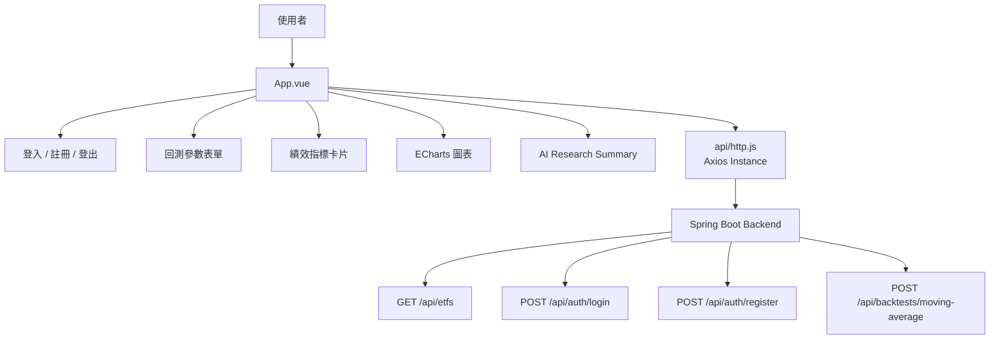
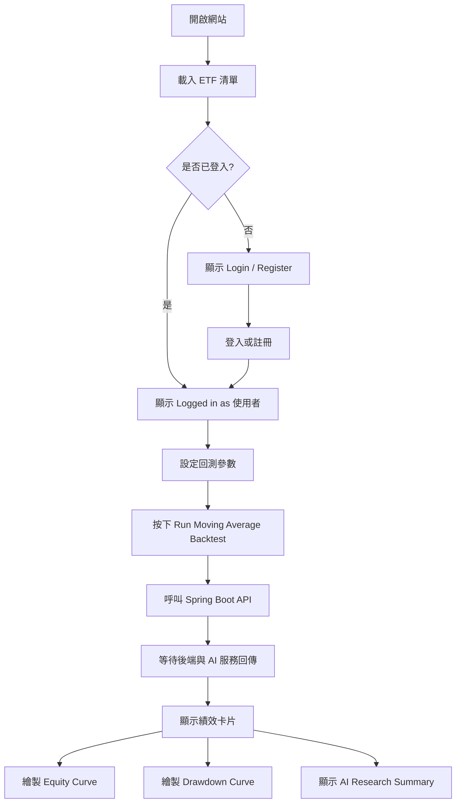
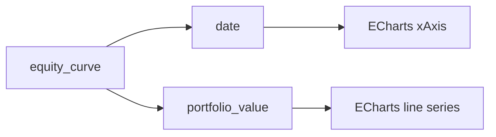

# frontend-vue README

> **Vue 3 前端儀表板**  
> 本前端是 AI-Powered Taiwan ETF Quant Research Dashboard 的使用者操作介面，負責登入 / 註冊、ETF 回測參數輸入、JWT token 管理、呼叫 Spring Boot API、顯示量化績效、繪製資產曲線與最大回撤圖，以及呈現 AI 中英雙語研究摘要。

---

## 目錄

1. [前端定位](#1-前端定位)
2. [線上 Demo](#2-線上-demo)
3. [前端架構總覽](#3-前端架構總覽)
4. [資料夾結構](#4-資料夾結構)
5. [使用技術](#5-使用技術)
6. [主要功能](#6-主要功能)
7. [畫面流程](#7-畫面流程)
8. [登入與 JWT 設計](#8-登入與-jwt-設計)
9. [API 串接設計](#9-api-串接設計)
10. [回測表單設計](#10-回測表單設計)
11. [圖表視覺化設計](#11-圖表視覺化設計)
12. [AI 摘要顯示設計](#12-ai-摘要顯示設計)
13. [錯誤處理與使用者體驗](#13-錯誤處理與使用者體驗)
14. [本機啟動方式](#14-本機啟動方式)
15. [Vercel 部署方式](#15-vercel-部署方式)
16. [測試流程](#16-測試流程)
17. [Debug 紀錄](#17-debug-紀錄)
18. [目前限制](#18-目前限制)
19. [未來擴充方向](#19-未來擴充方向)

---

## 1. 前端定位

`frontend-vue` 是本專案的前端使用者介面，主要負責將後端與 AI 服務的結果以清楚、可操作、可理解的方式呈現給使用者。

它在整體系統中的位置如下：

```text
使用者
  ↓
Vue Frontend
  ↓
Spring Boot Backend
  ↓              ↓
Supabase DB      Python Quant AI Service
```

前端的主要責任包括：

1. 顯示專案主頁與系統介紹
2. 載入 ETF 清單
3. 提供登入 / 註冊 / 登出介面
4. 保存 JWT token
5. 執行 ETF 回測請求
6. 顯示回測績效指標
7. 繪製 Equity Curve 與 Drawdown Curve
8. 顯示 AI 研究摘要
9. 顯示 `ai_provider`，確認 AI 摘要來源是 OpenAI 或 fallback
10. 顯示錯誤訊息，協助使用者理解目前系統狀態

這個前端不是單純的靜態頁面，而是完整串接登入、API、圖表與 AI 回傳結果的 Dashboard。

---

## 2. 線上 Demo

前端部署於 Vercel：

```text
https://ai-powered-taiwan-etf-quant-dashboa.vercel.app/
```

後端 API：

```text
https://taiwan-etf-springboot-backend.onrender.com
```

Python Quant AI Service：

```text
https://taiwan-etf-quant-ai-service.onrender.com
```

> 注意：後端與 AI 服務部署於 Render Free Plan。若服務閒置後進入休眠，第一次載入 ETF 清單或第一次執行回測可能會等待較久。

---

## 3. 前端架構總覽



### 前端設計概念

本前端採用單頁式 Dashboard 設計，將使用者常用流程集中在一個畫面中：

```text
登入區塊
↓
回測設定區塊
↓
績效摘要區塊
↓
圖表區塊
↓
AI 研究摘要區塊
```

這樣可以降低操作複雜度，讓初學者可以直接理解整個回測流程。

---

## 4. 資料夾結構

```text
frontend-vue/
│
├── src/
│   ├── api/
│   │   └── http.js
│   │
│   ├── App.vue
│   ├── style.css
│   └── main.js
│
├── public/
│
├── package.json
├── package-lock.json
├── vite.config.js
├── index.html
├── .env.example
├── .gitignore
└── README.md
```

### 主要檔案說明

| 檔案 | 說明 |
|---|---|
| `src/App.vue` | 主要畫面與核心前端邏輯 |
| `src/api/http.js` | Axios instance 與 JWT interceptor |
| `src/style.css` | 全站樣式設計 |
| `src/main.js` | Vue app 入口 |
| `.env.example` | 前端環境變數範例 |
| `package.json` | npm scripts 與套件設定 |

---

## 5. 使用技術

| 技術 | 用途 |
|---|---|
| Vue 3 | 前端框架 |
| Composition API | 使用 `ref`、`computed`、`onMounted` 管理狀態 |
| Vite | 開發伺服器與前端 build tool |
| Axios | 串接 Spring Boot API |
| Axios Interceptor | 自動加入 JWT Authorization header |
| ECharts | 繪製資產曲線與最大回撤圖 |
| localStorage | 保存登入 token 與使用者資料 |
| CSS | 自訂淺色系 Dashboard UI |
| Vercel | 前端雲端部署 |

---

## 6. 主要功能

### 6.1 ETF 清單載入

前端啟動後會自動呼叫：

```http
GET /api/etfs
```

取得 ETF 清單後放入下拉選單。

使用者可以選擇：

- `0050.TW` 元大台灣50
- `0056.TW` 元大高股息
- `006208.TW` 富邦台50
- `00713.TW` 元大台灣高息低波
- `00878.TW` 國泰永續高股息

---

### 6.2 使用者登入

前端提供 Login 表單：

```text
Phone Number
Password
```

登入成功後，後端回傳 JWT token，前端會儲存：

```text
auth_token
auth_user
```

到 `localStorage`。

---

### 6.3 使用者註冊

前端提供 Register 表單：

```text
Phone Number
Password
User Name
Registration Code
```

Registration Code 是保護機制，避免陌生人任意註冊並消耗 OpenAI 額度。

---

### 6.4 回測參數設定

使用者可以設定：

| 欄位 | 說明 |
|---|---|
| ETF Symbol | 選擇 ETF |
| Start Date | 回測開始日期 |
| End Date | 回測結束日期 |
| Short MA | 短期均線 |
| Long MA | 長期均線 |
| Transaction Cost | 交易成本 |

預設值：

```text
ETF Symbol: 0050.TW
Start Date: 2020-01-01
End Date: 2025-12-31
Short MA: 20
Long MA: 60
Transaction Cost: 0.001425
```

---

### 6.5 回測結果顯示

回測成功後，前端會顯示：

- Run ID
- ETF Symbol
- Strategy
- Total Return
- Annualized Return
- Annualized Volatility
- Sharpe Ratio
- Max Drawdown
- Number of Trades
- Equity Curve
- Drawdown Curve
- AI Provider
- 中文 AI 摘要
- English AI Summary

---

### 6.6 AI Provider 顯示

前端會顯示：

```text
AI Provider: openai
```

或：

```text
AI Provider: fallback
```

這個欄位可以確認目前 AI 摘要是否真的來自 OpenAI API。

---

## 7. 畫面流程



---

## 8. 登入與 JWT 設計

### 8.1 JWT 儲存位置

登入成功後，前端會將 token 存在：

```javascript
localStorage.setItem('auth_token', data.token)
```

使用者資訊存在：

```javascript
localStorage.setItem('auth_user', JSON.stringify(currentUser.value))
```

這樣重新整理頁面後，前端仍可維持登入狀態。

---

### 8.2 Axios Interceptor

`src/api/http.js` 中設定 Axios interceptor：

```javascript
http.interceptors.request.use((config) => {
  const token = localStorage.getItem('auth_token')

  if (token) {
    config.headers.Authorization = `Bearer ${token}`
  }

  return config
})
```

這代表只要 `localStorage` 裡有 token，所有 API request 都會自動附上：

```http
Authorization: Bearer <token>
```

因此使用者登入後，按下回測時不需要手動處理 token。

---

### 8.3 登入狀態判斷

前端使用：

```javascript
const isLoggedIn = computed(() => !!token.value)
```

如果沒有登入，回測按鈕會顯示：

```text
Login Required to Run Backtest
```

並且按鈕會被 disabled。

---

### 8.4 登出行為

登出時會清除：

```text
auth_token
auth_user
result
errorMessage
```

這樣可以避免登出後畫面上還保留前一位使用者的回測資料。

---

## 9. API 串接設計

### 9.1 Axios Instance

`src/api/http.js` 統一管理 API base URL：

```javascript
const http = axios.create({
  baseURL: import.meta.env.VITE_API_BASE_URL || 'http://localhost:8080/api',
  timeout: 120000,
})
```

設計原因：

- 本機開發時可使用 `http://localhost:8080/api`
- 部署到 Vercel 時使用 `VITE_API_BASE_URL`
- 所有 API 都透過同一個 http instance 呼叫
- 方便統一加上 JWT token

---

### 9.2 API 呼叫總覽

| 前端功能 | HTTP Method | Endpoint |
|---|---|---|
| 載入 ETF 清單 | GET | `/etfs` |
| 登入 | POST | `/auth/login` |
| 註冊 | POST | `/auth/register` |
| 執行回測 | POST | `/backtests/moving-average` |

實際完整 URL 會由 `baseURL` 組成，例如：

```text
https://taiwan-etf-springboot-backend.onrender.com/api/etfs
```

---

## 10. 回測表單設計

### 10.1 表單欄位

回測表單使用 Vue `v-model` 綁定：

```javascript
const selectedSymbol = ref('0050.TW')
const startDate = ref('2020-01-01')
const endDate = ref('2025-12-31')
const shortWindow = ref(20)
const longWindow = ref(60)
const transactionCost = ref(0.001425)
```

送出時組成 payload：

```javascript
const payload = {
  symbol: selectedSymbol.value,
  start_date: startDate.value,
  end_date: endDate.value,
  short_window: Number(shortWindow.value),
  long_window: Number(longWindow.value),
  transaction_cost: Number(transactionCost.value),
}
```

---

### 10.2 為什麼數字要轉型？

HTML input 即使 `type="number"`，透過 `v-model` 取得的值有時仍可能是字串。

因此送出前使用：

```javascript
Number(shortWindow.value)
Number(longWindow.value)
Number(transactionCost.value)
```

確保後端收到的是數字格式。

---

### 10.3 防止未登入執行回測

`runBacktest()` 一開始會檢查：

```javascript
if (!isLoggedIn.value) {
  errorMessage.value = 'Please login before running a backtest.'
  return
}
```

這是前端使用者體驗保護。真正的安全保護仍在 Spring Boot 後端，因為使用者可以繞過前端直接打 API。

---

## 11. 圖表視覺化設計

### 11.1 使用 ECharts

本專案使用 ECharts 繪製：

1. Equity Curve
2. Drawdown Curve

資料來源是後端回傳的：

```json
"equity_curve": [
  {
    "date": "2025-12-30",
    "portfolio_value": 2.695733,
    "drawdown": -0.001532
  }
]
```

---

### 11.2 Equity Curve

Equity Curve 顯示策略資產價值變化。



這可以讓使用者觀察策略長期是否成長。

---

### 11.3 Drawdown Curve

Drawdown Curve 顯示策略從歷史高點下跌的幅度。

```text
drawdown = portfolio_value / running_max - 1
```

最大回撤圖能幫助使用者理解策略風險，而不是只看總報酬。

---

### 11.4 圖表重繪設計

每次執行新回測後，若已有舊圖表，會先 dispose：

```javascript
if (equityChart) equityChart.dispose()
if (drawdownChart) drawdownChart.dispose()
```

再重新初始化：

```javascript
equityChart = echarts.init(equityElement)
drawdownChart = echarts.init(drawdownElement)
```

這可以避免多次回測造成圖表疊加或舊資料殘留。

---

## 12. AI 摘要顯示設計

### 12.1 AI Research Summary 區塊

前端會顯示：

```text
AI Research Summary
AI Provider: openai / fallback
中文摘要
English Summary
免責聲明
```

這個區塊讓使用者可以不只看數字，也能閱讀 AI 對策略結果的解釋。

---

### 12.2 AI Provider 的重要性

`ai_provider` 是一個實用的 debug 與透明度設計。

可能值：

```text
openai
fallback
```

| ai_provider | 代表意思 |
|---|---|
| `openai` | 本次摘要由 OpenAI API 生成 |
| `fallback` | 本次摘要由規則式模板生成 |

這讓使用者與開發者都能清楚知道目前 AI 功能是否真的呼叫模型。

---

## 13. 錯誤處理與使用者體驗

### 13.1 ETF 清單載入失敗

如果 `/api/etfs` 失敗，前端顯示：

```text
Failed to load ETF list from backend.
```

常見原因：

- Spring Boot backend 尚未啟動
- Render backend 正在 cold start
- Vercel 環境變數 `VITE_API_BASE_URL` 錯誤
- CORS 設定尚未允許前端網域

---

### 13.2 回測失敗

如果 `/api/backtests/moving-average` 失敗，前端顯示：

```text
Backtest failed. Please check backend and quant service.
```

常見原因：

- 尚未登入或 token 無效
- Python Quant AI Service 正在 cold start
- yfinance 暫時抓不到資料
- OpenAI API 發生錯誤但未正確 fallback
- Spring Boot 與 Python service URL 設定錯誤

---

### 13.3 Login / Register 失敗

登入失敗時顯示：

```text
Login failed. Please check your phone number and password.
```

註冊失敗時顯示：

```text
Register failed. Please check your registration code.
```

這樣使用者可以知道是帳密或註冊碼問題。

---

### 13.4 Loading 狀態

回測期間按鈕會顯示：

```text
Running Backtest...
```

並 disabled，避免使用者重複送出請求。

---

## 14. 本機啟動方式

### 14.1 安裝依賴

```powershell
cd frontend-vue
npm install
```

---

### 14.2 設定環境變數

建立 `.env`：

```env
VITE_API_BASE_URL=http://localhost:8080/api
```

也可以參考 `.env.example`。

---

### 14.3 啟動前端

```powershell
npm run dev
```

開啟：

```text
http://localhost:5173
```

---

### 14.4 前端本機開發需搭配後端

前端本身只是 UI，必須搭配：

```text
Spring Boot Backend: http://localhost:8080
Python Quant AI Service: http://localhost:8000
```

如果後端沒有啟動，ETF 清單與回測功能會失敗。

---

## 15. Vercel 部署方式

### 15.1 Vercel 專案設定

```text
Framework Preset: Vite
Root Directory: frontend-vue
Build Command: npm run build
Output Directory: dist
```

---

### 15.2 Vercel 環境變數

```text
VITE_API_BASE_URL=https://taiwan-etf-springboot-backend.onrender.com/api
```

注意：

1. Vite 前端環境變數必須以 `VITE_` 開頭
2. Vercel 設定環境變數後需要重新部署
3. value 要包含 `/api`

正確：

```text
https://taiwan-etf-springboot-backend.onrender.com/api
```

錯誤：

```text
http://localhost:8080/api
```

錯誤：

```text
https://taiwan-etf-springboot-backend.onrender.com
```

---

### 15.3 為什麼部署後不能用 localhost？

在本機開發時：

```text
localhost:8080 = 你電腦上的 Spring Boot
```

但部署到 Vercel 後：

```text
localhost:8080 = 使用者瀏覽器自己的電腦
```

所以正式部署必須使用 Render 後端網址。

---

## 16. 測試流程

### 16.1 基本載入測試

1. 開啟前端網站
2. 確認 ETF Symbol 下拉選單有資料
3. 若無資料，先檢查 `/api/etfs`

---

### 16.2 登入測試

1. 輸入 Phone Number
2. 輸入 Password
3. 點 Login
4. 成功後應顯示：

```text
Logged in as 使用者名稱
```

---

### 16.3 註冊測試

1. 切換到 Register
2. 輸入 Phone Number
3. 輸入 Password
4. 輸入 User Name
5. 輸入 Registration Code
6. 註冊成功後應自動登入

---

### 16.4 回測測試

設定：

```text
ETF Symbol: 0050.TW
Start Date: 2020-01-01
End Date: 2025-12-31
Short MA: 20
Long MA: 60
Transaction Cost: 0.001425
```

點擊：

```text
Run Moving Average Backtest
```

成功後應看到：

- Performance Summary
- Equity Curve
- Drawdown Curve
- AI Research Summary
- AI Provider

---

### 16.5 登出測試

1. 點 Logout
2. 回測結果應清除
3. 按鈕應回到：

```text
Login Required to Run Backtest
```

---

## 17. Debug 紀錄

### 17.1 Failed to load ETF list from backend

現象：

```text
Failed to load ETF list from backend.
```

可能原因：

- Spring Boot backend 尚未啟動
- Render backend 尚未喚醒
- Vercel `VITE_API_BASE_URL` 設錯
- CORS 未允許 Vercel domain

解法：

1. 直接開啟：

```text
https://taiwan-etf-springboot-backend.onrender.com/api/etfs
```

2. 確認 Vercel 環境變數：

```text
VITE_API_BASE_URL=https://taiwan-etf-springboot-backend.onrender.com/api
```

3. 確認 Spring Boot CORS：

```text
FRONTEND_ALLOWED_ORIGINS=https://your-vercel-domain.vercel.app,http://localhost:5173
```

---

### 17.2 Request URL 仍然是 localhost

現象：

瀏覽器 Network 顯示：

```text
http://localhost:8080/api/etfs
```

原因：

Vercel 沒有正確吃到 `VITE_API_BASE_URL`，或設定後沒有重新部署。

解法：

1. 到 Vercel Settings 設定 `VITE_API_BASE_URL`
2. 重新 Redeploy
3. 再用 F12 Network 檢查 Request URL

---

### 17.3 403 Forbidden

現象：

```text
Status Code: 403 Forbidden
```

可能原因：

- CORS 沒有允許 Vercel domain
- 回測 API 沒有帶 JWT token

判斷方式：

| 狀況 | 可能原因 |
|---|---|
| `/api/etfs` 403 | CORS / Security 設定問題 |
| `/api/backtests/**` 403 | 沒登入或 token 沒帶 |

解法：

- 檢查 Spring Boot `SecurityConfig`
- 檢查 Axios interceptor 是否有帶 `Authorization`
- 檢查 localStorage 是否有 `auth_token`

---

### 17.4 Backtest failed

現象：

```text
Backtest failed. Please check backend and quant service.
```

常見原因：

- Python FastAPI service 睡著
- Spring Boot 的 `QUANT_API_BASE_URL` 設錯
- 使用者未登入
- JWT token 過期或無效
- yfinance 暫時抓不到資料

解法：

先打開 Python service：

```text
https://taiwan-etf-quant-ai-service.onrender.com/
```

確認 Spring Boot 環境變數：

```text
QUANT_API_BASE_URL=https://taiwan-etf-quant-ai-service.onrender.com
```

---

### 17.5 登入後仍不能回測

可能原因：

1. token 沒有存進 localStorage
2. Axios interceptor 沒有加 Authorization header
3. Spring Boot JWT 驗證失敗
4. token 過期

檢查方式：

瀏覽器 DevTools → Application → localStorage：

```text
auth_token
auth_user
```

Network → Request Headers：

```http
Authorization: Bearer <token>
```

---

### 17.6 AI Provider 顯示 fallback

這不是前端錯誤，而是後端或 Python AI service 回傳的狀態。

代表可能：

- OpenAI API key 沒設定
- OpenAI 呼叫失敗
- 模型名稱錯誤
- 系統進入 fallback 模式

前端只負責呈現結果。

---

## 18. 目前限制

目前前端仍有以下可改進處：

1. 目前為單頁 Dashboard，尚未使用 Vue Router
2. 尚未拆分成多個 component
3. 尚未加入使用者歷史回測頁面
4. 尚未加入 loading skeleton
5. 錯誤訊息可再細分，例如 401、403、500、cold start
6. JWT token 過期時尚未自動登出
7. 尚未支援多策略切換 UI
8. 尚未支援下載 CSV / PDF 報告

---

## 19. 未來擴充方向

### 19.1 Component 化

目前主要邏輯集中在 `App.vue`，未來可拆成：

```text
components/
├── AuthPanel.vue
├── BacktestForm.vue
├── MetricCards.vue
├── EquityChart.vue
├── DrawdownChart.vue
└── AiReportPanel.vue
```

這樣可讀性與維護性會更好。

---

### 19.2 Vue Router

未來可加入頁面：

```text
/login
/dashboard
/history
/reports
```

讓前端結構更接近正式產品。

---

### 19.3 回測歷史頁面

後端已經把回測結果存進資料庫，未來可以加入：

- 我的回測紀錄
- 查看舊回測結果
- 多次策略比較
- AI 報告重新查看

---

### 19.4 更完整圖表

未來可加入：

- Benchmark comparison
- Monthly return heatmap
- Rolling volatility
- Rolling Sharpe ratio
- Trade markers

---

### 19.5 報告輸出

未來可加入：

- 匯出 CSV
- 匯出 Markdown
- 匯出 PDF
- 下載 AI 研究報告

---

## 20. 小結

`frontend-vue` 是整個 AI ETF 量化系統的使用者入口。它不只是表單頁面，而是完整整合了：

- Vue 3 Composition API
- Axios API 串接
- JWT token 管理
- 登入 / 註冊 / 登出
- ETF 回測參數設定
- ECharts 金融圖表
- AI 研究摘要展示
- Vercel 部署
- 前端錯誤處理與 debug 經驗

這個前端讓整個專案從後端 API 與 Python 量化服務，轉化成一般使用者可以實際操作、理解與展示的完整 Dashboard。

