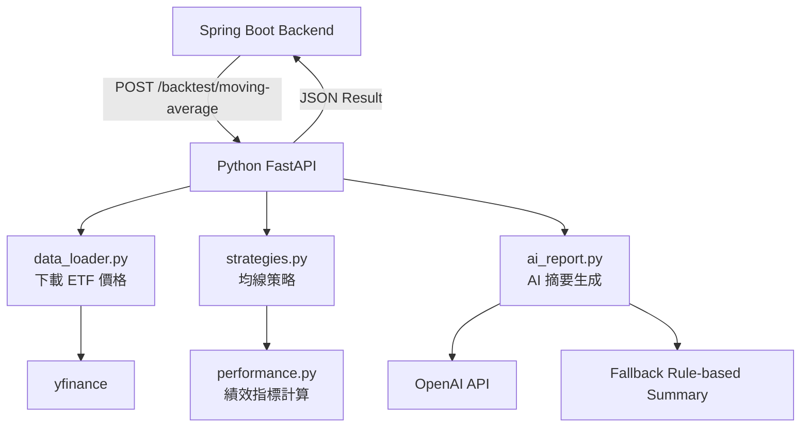
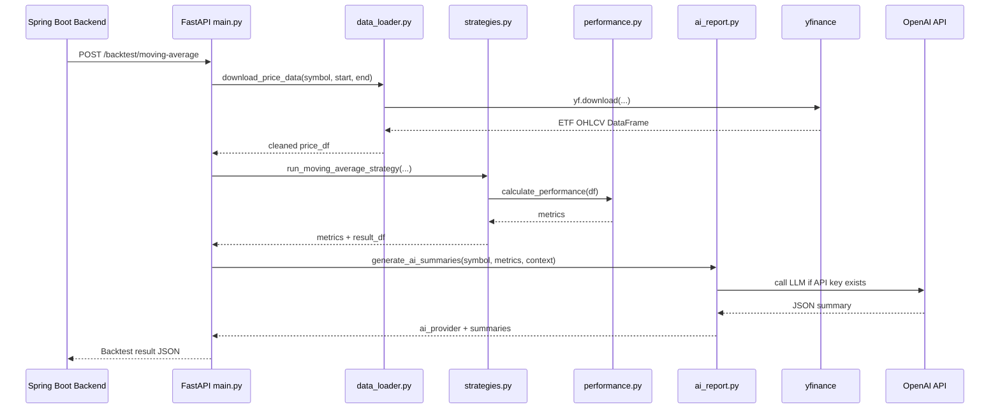
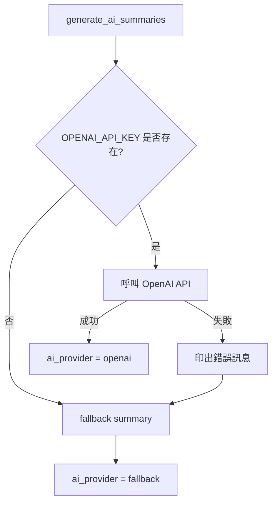

# quant-ai-service README

> **Python FastAPI 量化 AI 服務**  
> 本服務負責台股 ETF 歷史價格抓取、均線策略回測、績效指標計算，以及 OpenAI / fallback 中英雙語研究摘要生成。

---

## 目錄

1. [服務定位](#1-服務定位)
2. [線上服務網址](#2-線上服務網址)
3. [服務架構](#3-服務架構)
4. [資料流程](#4-資料流程)
5. [資料夾結構](#5-資料夾結構)
6. [核心模組說明](#6-核心模組說明)
7. [API 說明](#7-api-說明)
8. [均線策略邏輯](#8-均線策略邏輯)
9. [績效指標計算](#9-績效指標計算)
10. [OpenAI 與 fallback 機制](#10-openai-與-fallback-機制)
11. [本機啟動方式](#11-本機啟動方式)
12. [環境變數](#12-環境變數)
13. [Render 部署方式](#13-render-部署方式)
14. [測試方式](#14-測試方式)
15. [Debug 紀錄](#15-debug-紀錄)
16. [目前限制](#16-目前限制)
17. [未來擴充方向](#17-未來擴充方向)
18. [免責聲明](#18-免責聲明)

---

## 1. 服務定位

`quant-ai-service` 是本專案的 **量化分析與 AI 研究摘要引擎**。

它不是前端，也不是主要資料庫後端，而是一個獨立的 Python FastAPI 服務，專門負責：

1. 接收 Spring Boot 後端送來的回測請求
2. 使用 `yfinance` 抓取 ETF 歷史價格
3. 使用 `pandas` / `NumPy` 進行資料處理與策略計算
4. 執行均線策略回測
5. 計算績效指標
6. 呼叫 OpenAI API 產生中英雙語研究摘要
7. 若 OpenAI 不可用，自動使用 fallback 摘要
8. 回傳 JSON 給 Spring Boot

整體定位如下：

```text
Spring Boot Backend：負責登入、API、資料庫、Transaction
quant-ai-service：負責量化計算、ETF 資料、AI 摘要
Vue Frontend：負責表單、圖表、使用者互動
```

---

## 2. 線上服務網址

目前部署於 Render：

```text
https://taiwan-etf-quant-ai-service.onrender.com
```

健康檢查：

```text
GET https://taiwan-etf-quant-ai-service.onrender.com/
```

Swagger UI 文件：

```text
https://taiwan-etf-quant-ai-service.onrender.com/docs
```

> 注意：本服務部署於 Render Free Plan，閒置後可能會休眠。第一次請求可能需要等待 30～60 秒以上。

---

## 3. 服務架構



這個服務採用模組化設計：

| 模組 | 負責內容 |
|---|---|
| `main.py` | FastAPI 入口與 API endpoint |
| `schemas.py` | Request / Response schema |
| `data_loader.py` | 下載 ETF 歷史價格 |
| `strategies.py` | 均線策略邏輯 |
| `performance.py` | 績效指標計算 |
| `ai_report.py` | OpenAI / fallback 研究摘要 |

---

## 4. 資料流程



---

## 5. 資料夾結構

```text
quant-ai-service/
│
├── app/
│   ├── main.py
│   ├── schemas.py
│   ├── data_loader.py
│   ├── strategies.py
│   ├── performance.py
│   └── ai_report.py
│
├── requirements.txt
├── .env.example
├── .gitignore
└── README.md
```

---

## 6. 核心模組說明

### 6.1 `main.py`

`main.py` 是 FastAPI 的入口檔案。

主要功能：

- 建立 FastAPI app
- 提供健康檢查 `/`
- 提供回測 API `/backtest/moving-average`
- 串接資料下載、策略回測、績效計算與 AI 摘要
- 將結果整理成 response JSON

主要 endpoint：

```python
@app.get("/")
def root():
    ...

@app.post("/backtest/moving-average")
def moving_average_backtest(request):
    ...
```

---

### 6.2 `schemas.py`

`schemas.py` 使用 Pydantic 定義 API request / response 格式。

Request schema：

```json
{
  "symbol": "0050.TW",
  "start_date": "2020-01-01",
  "end_date": "2025-12-31",
  "short_window": 20,
  "long_window": 60,
  "transaction_cost": 0.001425
}
```

Response schema 會包含：

```json
{
  "symbol": "0050.TW",
  "strategy": "moving_average",
  "total_return": 1.695733,
  "annualized_return": 0.187105,
  "annualized_volatility": 0.160114,
  "sharpe_ratio": 1.168571,
  "max_drawdown": -0.294348,
  "number_of_trades": 19,
  "ai_provider": "openai",
  "ai_summary_zh": "...",
  "ai_summary_en": "...",
  "equity_curve": []
}
```

---

### 6.3 `data_loader.py`

`data_loader.py` 負責使用 yfinance 下載 ETF 歷史價格。

主要處理：

- 下載指定 ETF 的歷史價格
- 使用 `auto_adjust=True`
- 將欄位整理為統一格式
- 處理 yfinance 可能回傳 MultiIndex 欄位的情況
- 移除缺失值

輸出欄位：

```text
date
open
high
low
close
volume
```

目前資料來源是 yfinance，symbol 使用 Yahoo Finance 台股格式，例如：

```text
0050.TW
0056.TW
00878.TW
```

---

### 6.4 `strategies.py`

`strategies.py` 負責策略邏輯，目前實作：

```text
Moving Average Strategy
```

核心邏輯：

```text
short_ma = close price rolling mean over short_window
long_ma = close price rolling mean over long_window

if short_ma > long_ma:
    position = 1
else:
    position = 0
```

為避免 look-ahead bias，實際報酬使用前一天的 position：

```text
position = position.shift(1)
```

這代表今天的交易結果只使用昨天已知的訊號。

---

### 6.5 `performance.py`

`performance.py` 負責計算績效指標。

目前計算：

| 指標 | 說明 |
|---|---|
| Total Return | 整段回測期間總報酬 |
| Annualized Return | 年化報酬率 |
| Annualized Volatility | 年化波動率 |
| Sharpe Ratio | 風險調整後報酬 |
| Max Drawdown | 最大回撤 |

基本計算流程：

```text
strategy_return
↓
equity_curve = cumulative product of returns
↓
running maximum
↓
drawdown
↓
performance metrics
```

---

### 6.6 `ai_report.py`

`ai_report.py` 負責 AI 研究摘要。

它有兩種模式：

| 模式 | 條件 | 說明 |
|---|---|---|
| OpenAI mode | 有 `OPENAI_API_KEY` 且呼叫成功 | 使用 OpenAI API 生成研究摘要 |
| Fallback mode | 沒有 API key 或 OpenAI 呼叫失敗 | 使用規則式摘要，確保系統不中斷 |

回傳時會包含：

```json
{
  "ai_provider": "openai"
}
```

或：

```json
{
  "ai_provider": "fallback"
}
```

這個欄位是重要的小巧思，因為它讓前端和開發者可以清楚知道本次摘要到底是由 OpenAI 生成，還是使用 fallback 規則式摘要。

---

## 7. API 說明

### 7.1 Health Check

```http
GET /
```

Response：

```json
{
  "message": "AI-Powered Taiwan ETF Quant Service is running."
}
```

用途：

- 確認 FastAPI 是否啟動
- Render cold start 後可用來喚醒服務
- Spring Boot 或瀏覽器可直接測試

---

### 7.2 Moving Average Backtest

```http
POST /backtest/moving-average
```

Request：

```json
{
  "symbol": "0050.TW",
  "start_date": "2020-01-01",
  "end_date": "2025-12-31",
  "short_window": 20,
  "long_window": 60,
  "transaction_cost": 0.001425
}
```

Response example：

```json
{
  "symbol": "0050.TW",
  "strategy": "moving_average",
  "total_return": 1.695733,
  "annualized_return": 0.187105,
  "annualized_volatility": 0.160114,
  "sharpe_ratio": 1.168571,
  "max_drawdown": -0.294348,
  "number_of_trades": 19,
  "ai_provider": "openai",
  "ai_summary_zh": "本次針對 0050.TW 的均線策略回測結果顯示...",
  "ai_summary_en": "The moving average backtest for 0050.TW...",
  "equity_curve": [
    {
      "date": "2025-12-30",
      "portfolio_value": 2.695733,
      "drawdown": -0.001532
    }
  ]
}
```

---

## 8. 均線策略邏輯

### 8.1 策略概念

均線策略是一種常見的趨勢追蹤策略。它假設：

```text
當短期價格趨勢高於長期價格趨勢時，市場可能處於上升趨勢。
```

因此本專案採用：

```text
短期均線 > 長期均線 → 持有 ETF
短期均線 <= 長期均線 → 空手
```

---

### 8.2 避免前視偏誤

一個常見錯誤是使用當天收盤後才知道的均線訊號來賺取當天報酬，這會造成不合理的高估。

本專案使用：

```python
position = position.shift(1)
```

代表：

```text
今天的投資部位由昨天的訊號決定。
```

這樣比較接近真實交易流程。

---

### 8.3 交易成本

當 position 從 0 變 1，或從 1 變 0，就代表發生交易。

```text
trade = abs(position change)
cost = trade * transaction_cost
```

策略報酬：

```text
strategy_return = position * daily_return - cost
```

這個設計讓回測不會過度理想化。

---

## 9. 績效指標計算

### 9.1 Total Return

```text
total_return = final portfolio value - 1
```

表示整段回測期間的總報酬。

---

### 9.2 Annualized Return

```text
annualized_return = (1 + total_return) ^ (252 / number_of_days) - 1
```

本專案使用 252 作為一年交易日的簡化假設。

---

### 9.3 Annualized Volatility

```text
annualized_volatility = daily_return_std * sqrt(252)
```

用來衡量策略波動程度。

---

### 9.4 Sharpe Ratio

```text
sharpe_ratio = annualized_return / annualized_volatility
```

目前版本未額外扣除無風險利率，是簡化版 Sharpe Ratio。

---

### 9.5 Max Drawdown

```text
drawdown = portfolio_value / running_max - 1
max_drawdown = minimum drawdown
```

最大回撤代表資產從高點下跌到低點的最大跌幅，是風險分析中非常重要的指標。

---

## 10. OpenAI 與 fallback 機制

### 10.1 為什麼加入 OpenAI？

量化分析常常只有數字，但使用者不一定能快速理解數字背後的意義。

OpenAI 在本專案中扮演：

```text
AI Quant Research Analyst
```

它根據回測指標產生：

- 中文摘要
- English Summary
- 策略表現解釋
- 風險說明
- 教育與研究用途提醒

---

### 10.2 Prompt 設計原則

AI 摘要不應該幻想資料，因此 prompt 中限制：

```text
1. 只能根據提供的 metrics 分析
2. 不得捏造不存在的資料
3. 必須提到投資風險
4. 必須聲明不構成投資建議
5. 必須回傳 strict JSON
```

---

### 10.3 fallback 設計

如果 OpenAI API 發生問題，系統不會直接失敗，而是回到 fallback 摘要。



這個設計對部署很重要，因為雲端服務可能遇到：

- API key 沒設定
- OpenAI 額度不足
- 模型名稱錯誤
- OpenAI 回傳格式不是 JSON
- 暫時網路錯誤

---

## 11. 本機啟動方式

### 11.1 建立虛擬環境

```powershell
cd quant-ai-service
python -m venv venv
.\venv\Scripts\activate
```

---

### 11.2 安裝套件

```powershell
pip install -r requirements.txt
```

如果是第一次建立：

```powershell
pip install fastapi uvicorn pandas numpy yfinance python-dotenv openai
pip freeze > requirements.txt
```

---

### 11.3 設定 OpenAI 環境變數

如果要使用真正 OpenAI API：

```powershell
$env:OPENAI_API_KEY="your-openai-api-key"
$env:OPENAI_MODEL="gpt-4.1-mini"
```

如果不設定，系統會使用 fallback summary。

---

### 11.4 啟動服務

```powershell
uvicorn app.main:app --reload --port 8000
```

成功後開啟：

```text
http://localhost:8000
```

Swagger UI：

```text
http://localhost:8000/docs
```

---

## 12. 環境變數

### 12.1 `.env.example`

建議提供 `.env.example`，但不要上傳真正 `.env`。

```env
OPENAI_API_KEY=your-openai-api-key
OPENAI_MODEL=gpt-4.1-mini
```

---

### 12.2 `.gitignore`

```gitignore
venv/
__pycache__/
*.pyc
.env
```

這可以避免 API key 或虛擬環境被推上 GitHub。

---

## 13. Render 部署方式

### 13.1 Render 設定

```text
Service Type: Web Service
Runtime: Python 3
Root Directory: quant-ai-service
Build Command: pip install -r requirements.txt
Start Command: uvicorn app.main:app --host 0.0.0.0 --port $PORT
```

### 13.2 Render 環境變數

```text
OPENAI_API_KEY=your-openai-api-key
OPENAI_MODEL=gpt-4.1-mini
```

如果不設定 OpenAI API key，服務仍可啟動，但會回傳：

```json
{
  "ai_provider": "fallback"
}
```

---

## 14. 測試方式

### 14.1 測試健康檢查

```powershell
Invoke-RestMethod -Uri "http://localhost:8000/" -Method GET
```

預期結果：

```json
{
  "message": "AI-Powered Taiwan ETF Quant Service is running."
}
```

---

### 14.2 測試回測 API

```powershell
$body = @{
  symbol = "0050.TW"
  start_date = "2020-01-01"
  end_date = "2025-12-31"
  short_window = 20
  long_window = 60
  transaction_cost = 0.001425
} | ConvertTo-Json

Invoke-RestMethod `
  -Uri "http://localhost:8000/backtest/moving-average" `
  -Method POST `
  -ContentType "application/json" `
  -Body $body
```

若成功，會看到：

```text
symbol
total_return
annualized_return
annualized_volatility
sharpe_ratio
max_drawdown
number_of_trades
ai_provider
ai_summary_zh
ai_summary_en
equity_curve
```

---

### 14.3 確認 OpenAI 是否真的執行

看回傳欄位：

```json
"ai_provider": "openai"
```

代表 OpenAI API 有成功呼叫。

如果看到：

```json
"ai_provider": "fallback"
```

代表目前使用規則式 fallback 摘要。

---

## 15. Debug 紀錄

### 15.1 OpenAI 沒有真的執行

現象：

```text
ai_summary_zh 看起來像固定模板
```

原因可能是：

- `OPENAI_API_KEY` 沒有設定在同一個 terminal
- `OPENAI_MODEL` 名稱錯誤
- API key 額度不足
- OpenAI 回傳不是合法 JSON
- Render 環境變數未設定

解法：

新增 `ai_provider` 欄位，直接顯示本次來源：

```json
{
  "ai_provider": "openai"
}
```

或：

```json
{
  "ai_provider": "fallback"
}
```

---

### 15.2 Render 服務睡著導致 backtest failed

現象：

```text
Backtest failed. Please check backend and quant service.
```

原因：

Python FastAPI 服務部署在 Render Free Plan，閒置後會休眠。Spring Boot 呼叫它時，如果服務尚未醒來，可能造成第一次回測失敗或等待時間過長。

解法：

展示前先開啟：

```text
https://taiwan-etf-quant-ai-service.onrender.com/
```

等待服務回應後再執行回測。

---

### 15.3 yfinance 沒有抓到資料

現象：

```text
No price data found for symbol
```

可能原因：

- ETF symbol 錯誤
- 日期區間錯誤
- yfinance 暫時無法取得資料
- 網路暫時不穩定

解法：

確認 symbol 使用 Yahoo Finance 台股格式：

```text
0050.TW
0056.TW
00878.TW
```

---

### 15.4 中文摘要在 PowerShell 顯示亂碼

現象：

```text
中文顯示成 æ¬æ¬¡...
```

原因：

通常是 PowerShell 編碼顯示問題，不一定是 API 回傳錯誤。

解法：

可先執行：

```powershell
chcp 65001
[Console]::OutputEncoding = [System.Text.Encoding]::UTF8
$OutputEncoding = [System.Text.Encoding]::UTF8
```

或直接在 Swagger UI / 前端瀏覽器查看，通常中文會正常。

---

## 16. 目前限制

目前版本仍有一些限制：

1. 目前只實作均線策略
2. yfinance 資料來源可能有延遲或缺漏
3. Sharpe Ratio 為簡化版，未扣除無風險利率
4. 交易成本模型為簡化處理
5. 尚未加入 benchmark 比較
6. 尚未加入完整錯誤分類回傳
7. Render Free Plan 會有 cold start

---

## 17. 未來擴充方向

### 17.1 更多策略

可加入：

- Momentum Strategy
- RSI Strategy
- MACD Strategy
- Buy and Hold Benchmark
- Factor Strategy
- Volatility Targeting

---

### 17.2 更完整 AI 報告

未來可讓 OpenAI 生成完整研究報告：

- Abstract
- Research Motivation
- Data Source
- Methodology
- Backtesting Results
- Risk Analysis
- Limitations
- Conclusion

---

### 17.3 更正式資料來源

目前使用 yfinance 作為 MVP 資料來源。未來可串接：

- TWSE 官方資料
- ETF 配息資料
- ETF 成分股資料
- 指數資料

---

### 17.4 快取與資料庫整合

未來可將 yfinance 抓回來的價格資料存入 `etf_prices`，避免每次都重新下載。

可能流程：

```text
先查 etf_prices 是否已有資料
↓
若不足，再使用 yfinance 補資料
↓
回測使用資料庫與新資料合併結果
```

---

## 18. 免責聲明

本服務僅供教育、研究與作品集展示用途，不構成任何投資建議。所有回測結果皆基於歷史資料與簡化假設，過去績效不代表未來表現。

This service is for educational, research, and portfolio demonstration purposes only. It does not constitute investment advice. Backtesting results are based on historical data and simplified assumptions. Past performance does not guarantee future results.

